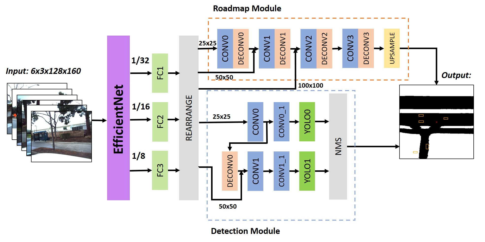

# Autodetection

This repository is the implementation for Autodetection by Jiuhong Xiao in New York University

**Autodetection: An End-to-end Autonomous Driving Detection System**

Jiuhong Xiao, Xinmeng Li, Junrong Zha

DEEP LEARNING 20SPRING (CSCI-GA 2572) final project



## Usage

### Dependencies

This work depends on the following library:

Python == 3.8

Pytorch == 1.4.0

### Train and Validate

Data should be located at dataset/data/

Run all code in the root directory, e.g., to run trainBothFPN.py

```
python training/trainBothFPN.py
```

If you want to train LSTMmodel, make sure step_size in helper.py = batch_size in bothModelLSTM.py = scene_batch_size in trainBothLSTM.py. To adjust the length of sliding window of LSTM, change step_size in bothModelLSTM.py.

To train from pretrained model, set pretrain_file in train***.py. Otherwise, set pretrain_file = None.

## Results


## Reference Repo

The implemention of EfficientNet and YOLOv3 layeris based on Lukemelas's implemention https://github.com/lukemelas/EfficientNet-PyTorch.git and Eriklindernoren's implementation https://github.com/eriklindernoren/PyTorch-YOLOv3.git with some revisement.
Thank you very much!
